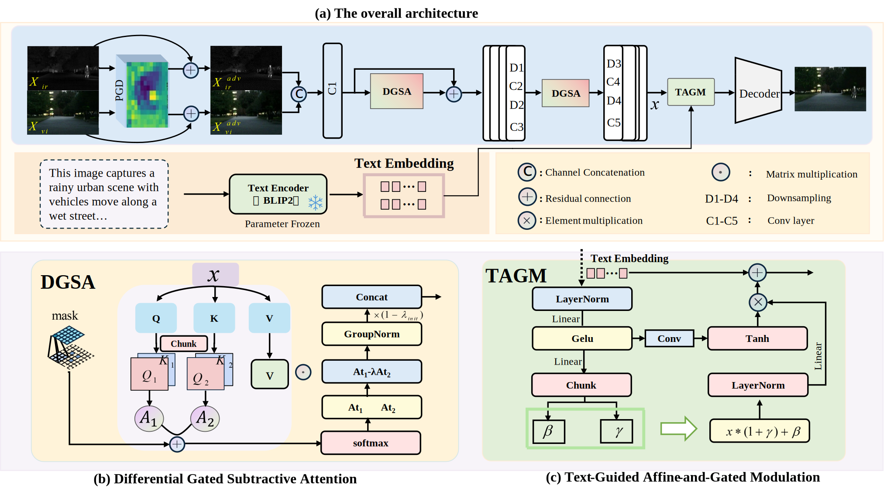
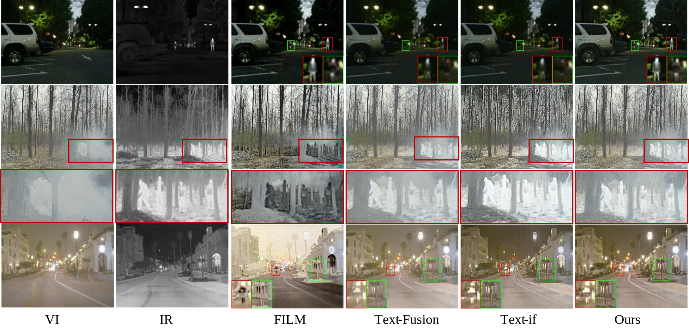
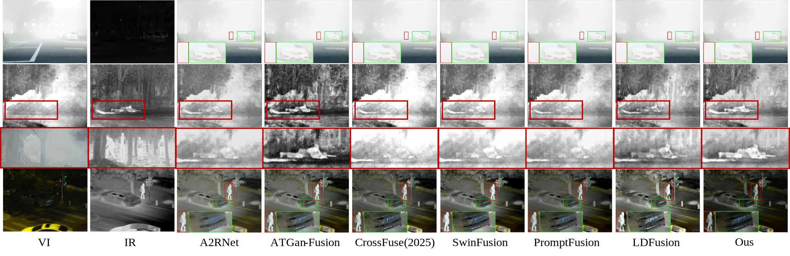

# TGDA: Text-Guided Differential Attention for Adversarial Infrared and Visible Image Fusion

[](./LICENSE)
[](https://www.python.org/)
[](https://pytorch.org/)

## 📖 Abstract

Infrared and visible image fusion (IVIF) enhances perception by integrating complementary modalities, yet adversarial robustness and language-controllable fusion remain underexplored. We propose a text-guided, adversarially robust IVIF framework with differential attention, which, to the best of our knowledge, is the first to introduce this mechanism into infrared–visible image fusion. By replacing softmax with a learnable difference of two causal attentions, our method achieves stable gradients and resilience to perturbations.The architecture adopts a UNet-style pyramid with efficient self-similarity attention blocks. Training employs PGD-based adversarial augmentation. Extensive experiments demonstrate that our approach (TGDA) generally achieves superior performance compared with conventional fusion methods.

**Key Innovations:**
- **Differential Gated Subtractive Attention (DGSA)**. A dualattention mechanism with causal masking that suppresses irrelevant context, stabilizes gradients, and strengthens adversarial robustness.
- **Text-Guided Affine-and-Gated Modulation (TAGM)**. A conditioning module that injects textual embeddings via affine channel shifts and gated spatial priors, enabling controllable, task-aware fusion.

## 🚀 Key Features

- 🛡️ **Robust to Adversarial Attacks**: Maintains fusion quality under various attack scenarios
- 🔄 **Multi-Modal Integration**: Effectively fuses infrared, visible, and textual information
- 🎯 **State-of-the-Art Performance**: Superior results on multiple benchmarks

### Availability (Upon Acceptance)
- To avoid review interference and unintended reuse, the complete training code will be released upon paper acceptance. This repository already includes inference/evaluation scripts and reproducible settings. You can verify results using the commands provided below.

## 🏗️ Architecture Overview

<div align="center">
  
  <p><em>Overall architecture of the proposed TGDA framework</em></p>
</div>

## 📋 Requirements

### Environment Setup
```bash
# Create conda environment
conda create -n tgda python=3.10
conda activate tgda

# Install PyTorch (adjust CUDA version as needed)
pip install torch==1.13.0 torchvision==0.14.0 --index-url https://download.pytorch.org/whl/cu116

# Install other dependencies
pip install -r requirements.txt
```

### Dependencies
- Python 3.10+
- PyTorch 1.13.0+
- torchvision 0.14.0+
- OpenCV 4.9+
- NumPy 1.26.4+
- Pillow 10.3.0+
- einops
- transformers (for BLIP2)


### Dataset Structure
```
datasets/
├── M3FD/
│   ├── ir/
│   ├── vis/
│   └── labels/
├── RoadScene/
│   ├── ir/
│   ├── vis/
│   └── labels/
└── MSRS/
    ├── ir/
    ├── vis/
    └── labels/
```

## 🔧 Usage

### Training
```bash
# Train with adversarial training
python train_robust.py --dataset M3FD 
```

### Inference
```bash
# Test with adversarial robustness evaluation
python test_robust.py --dataset M3FD 
```


### Reproducibility: PGD Adversarial Augmentation Details
- **Iterative update (PGD, l∞-bounded)**:
  1. Convert the current adversarial visible image to YCrCb and take it (together with the current adversarial infrared image and text features) as the model input.
  2. Compute the fusion loss against the ground-truth Y channel.
  3. Backpropagate to obtain gradients w.r.t. both inputs.
  4. Take a sign-gradient step on each input.
  5. Project the perturbations back into the l∞ ball around the clean inputs and clamp to [0,1].
  6. Re-enable gradients and repeat for the configured number of iterations.
For robustness evaluation, we adopt a stronger PGD by default (e.g., 20 steps).

### Ablation Variants (for Fair Comparison)
- **Baseline (no adversarial training)**: disable PGD while keeping all other settings identical
- **w/o Text Guidance**: remove `TAGM` text conditioning module
- **w/o DGSA**: replace `DGSA` with standard attention 

### DGSA: Learnable λ Reparameterization and Motivation
We parameterize each head with a signed gating coefficient $\lambda$, defined as the difference of two non-negative exponential inner products plus an additive bias $\lambda_{\text{init}}$.  This design allows $\lambda$ to be either positive or negative, thereby selectively amplifying or attenuating the subtractive branch, while the exponential terms guarantee smooth gradients and non-negativity.  We set $\lambda_{\text{init}}=0.8$ to provide a constructive prior at initialization: (i) ensuring a non-zero gating signal so that the subtractive path is active from the beginning, (ii) maintaining well-conditioned gradients without vanishing updates, and (iii) preventing the subtractive branch from being overly suppressed or dominating the primary attention.  The specific choice of $0.8$ empirically balances stability and adaptability, offering a mild bias toward constructive fusion while leaving sufficient capacity for $\lambda$ to be adjusted during training.

## 🎨 Visualization
<div align="center">
  
  <p><em>Making full use of qualitative comparison under text conditions</em></p>
</div>
<div align="center">
  
  <p><em>Qualitative comparison under generalization conditions</em></p>
</div>


## 📚 Citation

If you find this work useful for your research, please cite:
……
```

## 📄 License

This project is licensed under the MIT License - see the [LICENSE](LICENSE) file for details.


